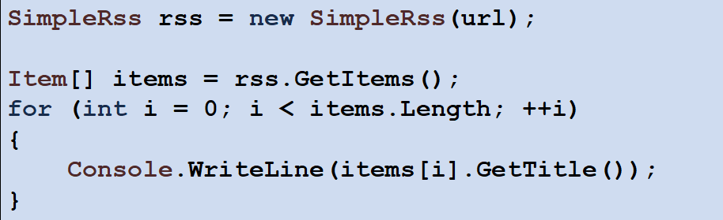
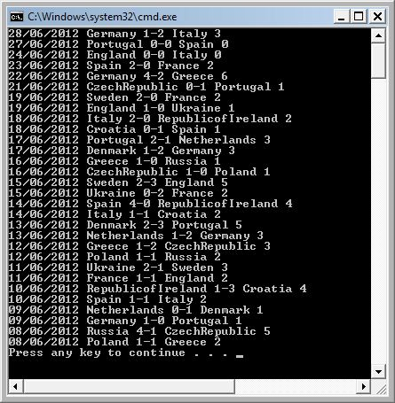

# SimpleCSE
SimpleCSE (Computer Science Education) is a collection of software libraries, for computer-science and programming teaching.  


# About
**SimpleCSE** is an *open-source* project, made by the community for the use of teachers and students - to make the programming learning experience more interesting and fun.  


# Content
Currently, the project contains few fetures:
* **SimpleGoogleMaps** - a simple to use, easy API, interface to interact with Google Maps service
* **SimpleRSS** - a simple to use, easy API, for getting RSS content from any RSS supported web site
* **SimpleImage** - for manipulating images using basic API, with setters/getters for each pixel  

# First Example
Just to make sure everything is alive - 
* Create a new java project in your favorite IDE
* Add the **SimpleCSE** JAR file to the project
* Create new class "*TrySimpleImage*", and try the following code:
``` java
import edu.cse.simplecse.simpleImage.*;

public class TrySimpleImage {
	public static void main(String[] args) {
		SimpleImage si = new SimpleImage();
		si.loadUrl("https://raw.githubusercontent.com/oriarad/simple-cse/master/screenshots/SimpleImage-example-output1.png");
		si.showImage();
	}
}
```

# SimpleRSS
Code example:  

  

Will produce the following output:  



# Links
* [JIRA](https://simplecse.atlassian.net/browse/SIMPLECSE)
* [Confluence](https://simplecse.atlassian.net/wiki/spaces/SIM)


